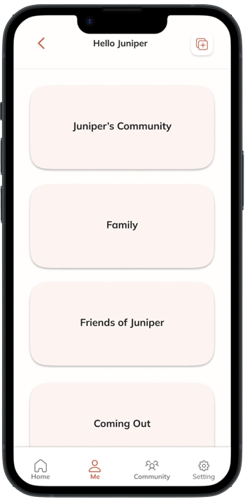
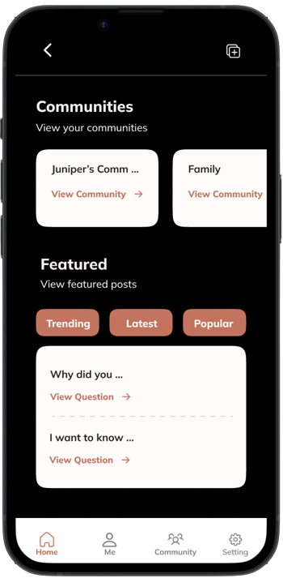
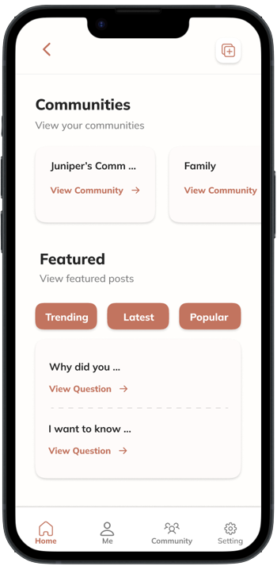
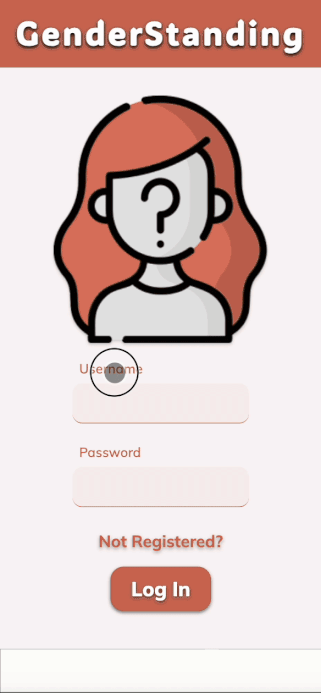

<div align="center">
  <a href="https://github.com/Genderstanding/Genderstanding">
   <h3 align="center"> <br/>Genderstanding</h3>
  </a>
 <a href="/">View Demo</a>
  <p align="center">
          An invite-only social media platform that provides a safe community space, allowing users to invite friends and family to ask questions anonymously.
    <br />
    <br />
  </p>
</div>


### **Table Of Content**
<details>
  <summary></summary>
  <ul>
        <li><a href="#built-with">Built With</a></li>
        <li><a href="#prerequisites">Prerequisites</a></li>
        <li><a href="#installation">Installation</a></li>
         <li><a href="#screenshot">Screenshot</a></li>
          <li><a href="#usage">Usage</a></li>
  </ul>
</details>

### **Built With**
<br/>
<p>
 
  &nbsp;
  
  &nbsp;
  
   &nbsp;
    
  &nbsp;
   
   &nbsp;
  
   &nbsp;
   
  &nbsp;
   
</p>

### **Prerequisites**
Before you get started, make sure you have the following software installed on your computer:
* [Node.js](https://nodejs.org/en/)

### **Installation**
1. Fork and Clone the repository to your local computer using SSH key
1. In the terminal of your editor run `npm install` to install all dependencies
1.  Create a `.env` file at the root of the project and paste this line into the file:
- replace `superDuperSecret` with some long random string like `25POUbVtx6RKVNWszd9ERB9Bb6`. Here's a site that can help you: [https://passwordsgenerator.net/](https://passwordsgenerator.net/)
```
  SERVER_SESSION_SECRET=superDuperSecret
```
4. Start postgres if not running already by using `brew services start postgresql`
1. Create a database named `genderstanding`
1. Run `database.sql` file
1. Open two terminal windows
1. Run `npm run server`
1. Run `npm run client`
1. Navigate to `localhost:3000`

### **Screenshot**
<br/>




<!--  -->

## Usage

Video walkthrough of application usage: 

<p align="right"><a href="#top">back to top</a></p>

<!-- MARKDOWN LINKS & IMAGES -->
<!-- https://www.markdownguide.org/basic-syntax/#reference-style-links -->

# Genderstanding

